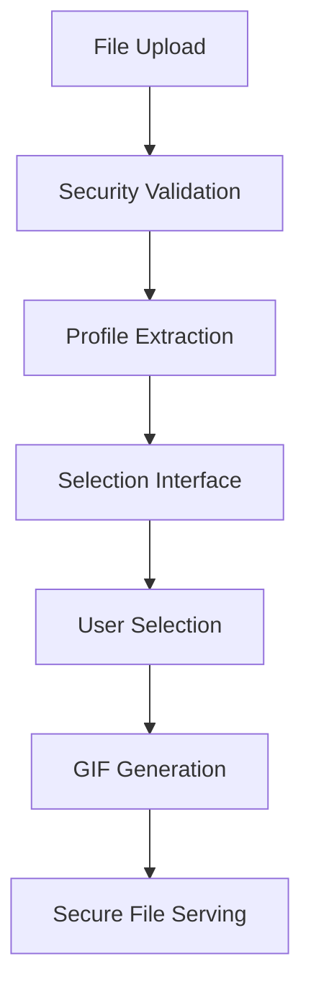

# FreeDurov Application - Latest Revisions Summary

## 🚀 Major Feature Updates

### 1. Interactive Profile Selection Interface
**New Feature**: Two-stage processing workflow with user selection capabilities

**Implementation**:
- **New Route**: `/selection/<job_id>` - Interactive profile selection interface
- **New Template**: `selection.html` - Responsive grid layout with checkboxes for profile selection
- **Enhanced Processing**: Separated profile extraction from GIF creation phases
- **User Control**: Users can now select which extracted profiles to include in GIF generation

**Key Components**:
```python
# New route in app.py
@app.route('/selection/<job_id>')
def selection(job_id):
    # Display extracted profiles for user selection
    
@app.route('/confirm_selection/<job_id>', methods=['POST'])
def confirm_selection(job_id):
    # Process user selections and trigger GIF creation
```

### 2. Enhanced Security Framework
**Comprehensive Security Improvements**:

- **Path Traversal Protection**: Enhanced security validation in `security_utils.py`
- **Secure File Serving**: New `/download/<path:filename>` route with comprehensive validation
- **Job ID Validation**: Regex-based validation to prevent injection attacks
- **Content Validation**: Binary file content verification for uploaded images
- **Safe Filename Generation**: Unique, secure filename generation with timestamp prefixes

**Security Implementation**:
```python
# Enhanced security validation
def validate_uploaded_file(file):
    # Multi-layer validation including content, filename, and size checks
    
@app.route('/download/<path:filename>')
def download_file(filename):
    # Secure file serving with comprehensive validation
```

### 3. Modular Processing Architecture
**Separated Processing Phases**:

**Phase 1 - Profile Extraction** (`image_processor.process_avasplit`):
- Detects and extracts individual profiles from uploaded images
- Saves individual profile images with consistent naming (`profile_001.jpg`, etc.)
- Returns profile regions and filenames for selection interface

**Phase 2 - Selective GIF Creation** (`image_processor.create_gifs_from_selected_profiles`):
- Creates GIFs only from user-selected profiles
- Supports batch processing of multiple selected profiles
- Enhanced error handling and validation

```python
# New modular approach
def process_avasplit(image_filepath, output_path):
    # Extract profiles without creating GIFs
    return profile_regions, profile_filenames
    
def create_gifs_from_selected_profiles(selected_profiles, output_path):
    # Create GIFs only from selected profiles
    return gif_files
```

### 4. Enhanced Job Management System
**Asynchronous Processing with Status Tracking**:

- **Job States**: `PENDING` → `PROCESSING` → `PROFILES_EXTRACTED` → `CREATING_GIFS` → `COMPLETED` / `FAILED`
- **Background Threading**: Non-blocking processing with daemon threads
- **Resource Cleanup**: Automatic cleanup of old jobs and temporary files
- **Session Management**: Secure job ID generation with timestamp prefixes

```python
# Job status tracking
job_data = defaultdict(lambda: {
    'status': 'PENDING',
    'output_files': [],
    'profile_filenames': [],
    'selected_profiles': [],
    'created_at': time.time()
})
```

## 🎨 User Interface Enhancements

### 1. Interactive Selection Interface
**New Template**: `templates/selection.html`

**Key Features**:
- **Responsive Grid Layout**: Professional thumbnail display of extracted profiles
- **Interactive Controls**: "Select All" and "Select None" buttons
- **Dynamic Feedback**: Real-time selection counter and visual feedback
- **Accessibility**: Keyboard shortcuts (Ctrl+A to select all, Escape to deselect all)
- **Visual Indicators**: Checkmark overlays and highlighting for selected profiles

```html
<!-- Selection interface elements -->
<div class="selection-controls">
    <button type="button" id="select-all-btn">Select All</button>
    <button type="button" id="select-none-btn">Select None</button>
    <span id="selection-count">0 selected</span>
</div>

<div class="profiles-grid">
    <!-- Dynamic profile thumbnails with checkboxes -->
</div>
```

### 2. Enhanced Result Display
**Improved**: `templates/result.html`

**New Features**:
- **Individual GIF Containers**: Each GIF displayed in its own container
- **Download Links**: Direct download buttons for each generated GIF
- **File Information**: Display filename and metadata
- **Professional Layout**: Clean, organized result presentation

### 3. Real-time Status Updates
**Enhanced Processing Feedback**:
- **Loading Animations**: Visual feedback during processing phases
- **Status Polling**: Automatic status updates without page refresh
- **Progress Indicators**: Clear indication of current processing phase

## 🔒 Security Enhancements

### 1. Comprehensive Input Validation
**Enhanced File Security**:
- **Multi-layer Validation**: Filename, content, and metadata validation
- **Content Verification**: Binary content analysis for image files
- **Path Sanitization**: Prevention of path traversal attacks
- **Size Limits**: Configurable file size restrictions with proper enforcement

### 2. Secure File Operations
**Protected File Handling**:
- **Safe Directory Creation**: Secure temporary directory management
- **Controlled File Access**: Files served only from designated directories
- **Resource Cleanup**: Automatic cleanup of temporary files and old jobs
- **Error Handling**: Graceful handling of file operation failures

### 3. Route Protection
**Enhanced Security Measures**:
- **Job ID Validation**: Regex-based format validation for job identifiers
- **Access Control**: Protected routes with proper authentication
- **Error Messages**: Secure error reporting without information disclosure

## 🔧 Technical Implementation Details

### 1. Enhanced Routing Structure
**Complete Route Map**:

```python
# Core Application Routes
GET  /                              # Main upload interface
POST /                              # Secure file upload handler
GET  /selection/<job_id>            # NEW - Interactive profile selection
POST /confirm_selection/<job_id>    # NEW - Process user selections
GET  /result/<job_id>               # Enhanced results with secure URLs
GET  /job_status/<job_id>           # Real-time status updates
GET  /download/<path:filename>      # NEW - Secure file serving
GET  /static/uploads/<path:filename> # Legacy compatibility
GET  /debug/files                   # Development debugging
```

### 2. Processing Pipeline Architecture
**Workflow Sequence**:



**Key Processing Functions**:
```python
# Core processing pipeline
image_processor.process_avasplit()          # Phase 1: Extract profiles
image_processor.create_gifs_from_selected_profiles() # Phase 2: Create GIFs
security_utils.validate_filename()          # Security validation
security_utils.secure_path_join()          # Path security
```

### 3. Configuration Management
**Environment-based Configuration**:
- All settings configurable via environment variables with `FREEDUROV_` prefix
- Fallback defaults in `config.py` for development
- Runtime parameter validation and type checking
- Support for boolean, integer, and string configurations

### 4. Error Handling & Recovery
**Robust Error Management**:
- Comprehensive exception handling in all processing phases
- Graceful degradation for processing failures
- Detailed logging with structured error messages
- User-friendly error reporting without security information disclosure

## 🧪 Comprehensive Testing Framework

### Test Suite Components
**Core Test Files**:
- `test_application.py` - Comprehensive unit testing suite
- `test_server.py` - Server functionality and routing tests
- `test_file_serving.py` - Security and file serving validation
- `test_complete_pipeline.py` - End-to-end pipeline testing
- `integration_test.py` - System integration validation
- `manual_test.py` - Interactive manual testing tools
- `run_tests.py` - Automated test runner with reporting

**Testing Coverage**:
- **Unit Tests**: Individual component functionality
- **Integration Tests**: Component interaction validation
- **Security Tests**: Input validation and path traversal protection
- **Performance Tests**: Processing speed and resource usage
- **User Interface Tests**: Frontend interaction validation

### Running the Test Suite
```bash
# Complete test suite
python run_tests.py

# Specific test categories
python -m pytest test_application.py -v --tb=short
python test_complete_pipeline.py
python manual_test.py

# Security-focused testing
python test_file_serving.py
```

## 🚀 Performance & Scalability

### Optimizations Implemented
- **Asynchronous Processing**: Background threads for non-blocking operations
- **Memory Management**: Efficient image processing with proper cleanup
- **File I/O Optimization**: Streamlined file operations with validation caching
- **Session Management**: Efficient job data structures with automatic cleanup

### Resource Management
- **Temporary File Cleanup**: Automatic cleanup of processing artifacts
- **Memory Optimization**: Efficient handling of large image files
- **Disk Space Management**: Configurable storage limits and cleanup policies
- **Background Task Management**: Proper daemon thread handling

## 📊 Expected Behavior (Latest Revision)

### User Workflow
✅ **Upload Phase**: Secure file upload with comprehensive validation  
✅ **Processing Phase**: Real-time status updates during profile extraction  
✅ **Selection Phase**: Interactive interface for profile selection  
✅ **Generation Phase**: GIF creation only from selected profiles  
✅ **Download Phase**: Secure file serving with individual download links  

### Technical Validation
✅ **Security**: All file operations pass security validation  
✅ **Performance**: Efficient processing with proper resource management  
✅ **Error Handling**: Graceful handling of all error conditions  
✅ **User Experience**: Professional interface with real-time feedback  
✅ **Code Quality**: Comprehensive testing and documentation  

## 🛠️ Development & Deployment

### Development Setup
```bash
# Quick start for development
git clone <repository>
cd FreeDurov
pip install -r requirements.txt
python test_server.py  # Recommended for development
```

### Production Deployment
```bash
# Production setup
export FREEDUROV_DEBUG=false
export FREEDUROV_LOG_LEVEL=INFO
python app.py  # Full Flask application
```

### Monitoring & Debugging
- **Comprehensive Logging**: Structured logs for all operations
- **Debug Endpoints**: Development-time debugging tools
- **Error Tracking**: Detailed error reporting and tracking
- **Performance Monitoring**: Resource usage and processing time tracking

The latest revision transforms FreeDurov from a basic image processing tool into a sophisticated, user-controlled GIF generation platform with enterprise-grade security, comprehensive testing, and professional user experience.